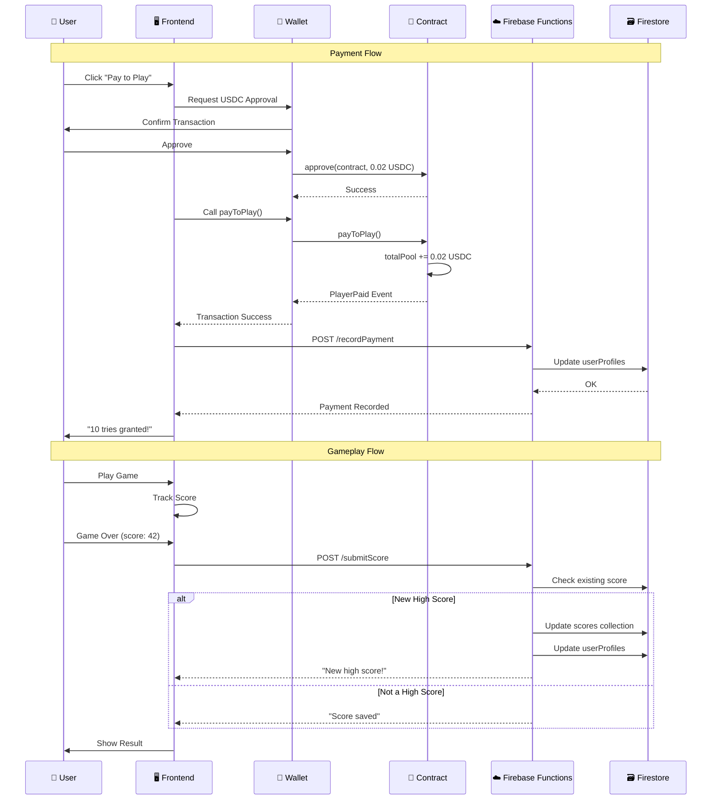
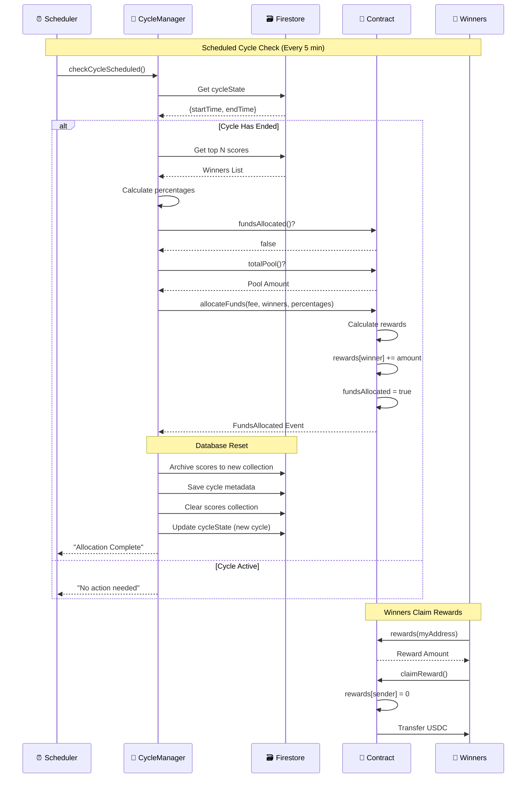
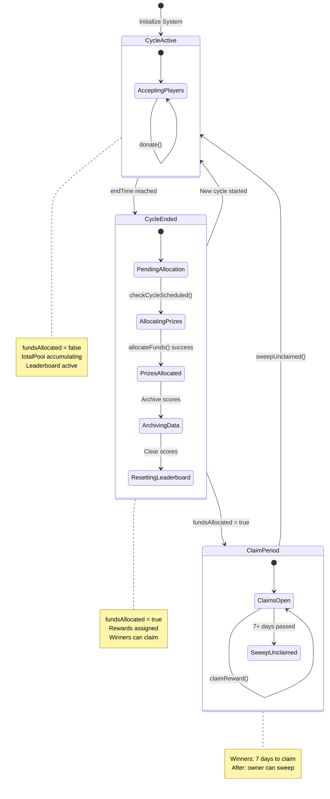
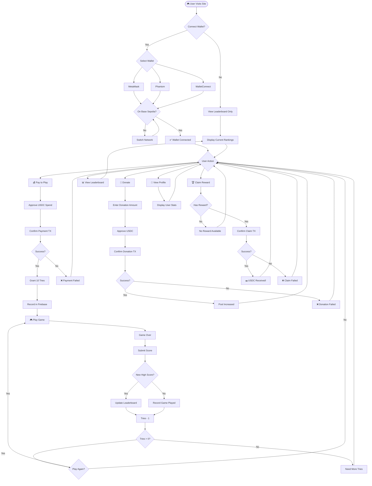
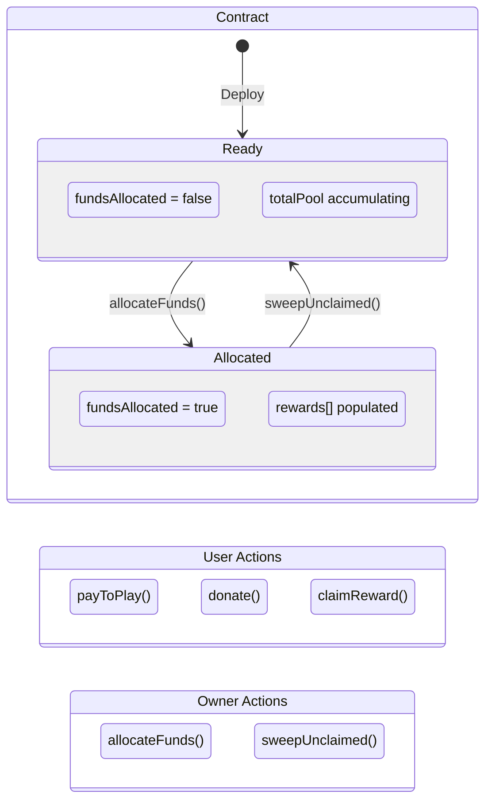
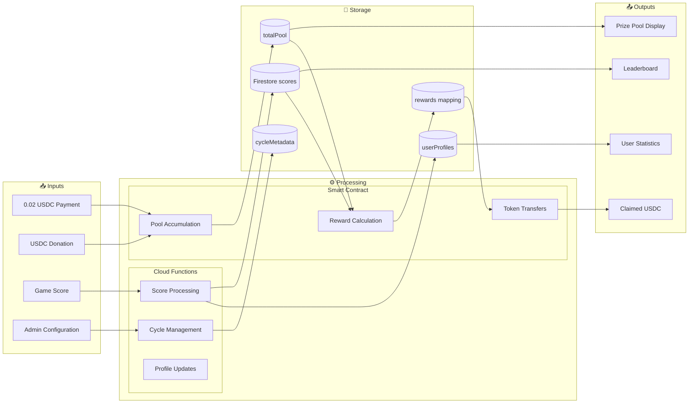

# Flappy Bird Prize Pool - System Diagrams

## 1. System Interaction Diagram (Component Architecture)

```mermaid
flowchart TB
    subgraph Frontend["🖥️ Frontend (HTML/JS)"]
        UI[Game UI]
        Wallet[Wallet Connection]
        GameJS[game.js]
        PaymentsJS[payments.js]
        LeaderboardJS[leaderboard.js]
    end

    subgraph Firebase["☁️ Firebase Cloud Functions"]
        IndexJS[index.js]
        CycleManager[cycleManager.js]
        subgraph AdminFunctions["Admin Functions"]
            UpdateCycle[updateCycleDuration]
            UpdateWinners[updateNumberOfWinners]
            UpdateFee[updateFeePercentage]
            GetConfig[getAdminConfig]
        end
        subgraph UserFunctions["User Functions"]
            SubmitScore[submitScore]
            RecordPayment[recordPayment]
            GetProfile[getUserProfile]
            GetLeaderboard[getLeaderboard]
        end
        subgraph CycleFunctions["Cycle Functions"]
            CheckCycle[checkCycleScheduled]
            ForceAllocate[forceAllocate]
            AllocateFunds[allocateFundsToWinners]
        end
    end

    subgraph Firestore["🗃️ Firestore Database"]
        Scores[(scores)]
        UserProfiles[(userProfiles)]
        CycleState[(cycleState)]
        Config[(config)]
        CycleMetadata[(cycleMetadata)]
        Archives[(archived scores)]
    end

    subgraph Blockchain["⛓️ Base Sepolia"]
        Contract[FlappyBirdPrizePool.sol]
        USDC[USDC Token]
    end

    subgraph ExternalWallet["👛 User Wallet"]
        MetaMask[MetaMask]
        Phantom[Phantom]
        WC[WalletConnect]
    end

    %% Frontend to Wallet
    UI --> Wallet
    Wallet --> MetaMask
    Wallet --> Phantom
    Wallet --> WC

    %% Frontend to Firebase Functions
    GameJS -->|POST /submitScore| SubmitScore
    PaymentsJS -->|POST /recordPayment| RecordPayment
    LeaderboardJS -->|GET /getLeaderboard| GetLeaderboard
    LeaderboardJS -->|GET /getArchivedLeaderboards| CycleMetadata

    %% Frontend to Blockchain
    PaymentsJS -->|payToPlay(), donate()| Contract
    PaymentsJS -->|claimReward()| Contract
    PaymentsJS -->|rewards(), totalPool()| Contract

    %% Firebase to Firestore
    SubmitScore --> Scores
    SubmitScore --> UserProfiles
    RecordPayment --> UserProfiles
    GetLeaderboard --> Scores
    GetConfig --> Config
    GetConfig --> CycleState
    CheckCycle --> CycleState
    ForceAllocate --> CycleState
    AllocateFunds --> CycleMetadata
    AllocateFunds --> Archives

    %% Firebase to Blockchain
    AllocateFunds -->|allocateFunds()| Contract
    CycleManager -->|fundsAllocated(), totalPool()| Contract

    %% Contract to Token
    Contract <-->|transferFrom, transfer| USDC

    %% Wallet to Blockchain
    MetaMask --> Contract
    Phantom --> Contract
    WC --> Contract
```

---

## 2. Behavior Diagram (Sequence Diagram)

### 2.1 Player Payment & Game Flow



### 2.2 Cycle End & Prize Allocation Flow



---

## 3. State Diagram (Cycle States)



---

## 4. Activity Diagram (Full System Flow)



---

## 5. Contract State Transitions



---

## 6. Data Flow Diagram



---

## Legend

| Symbol | Meaning |
|--------|---------|
| 🖥️ | Frontend/UI |
| ☁️ | Cloud Functions |
| 🗃️ | Database |
| 📜 | Smart Contract |
| 👛 | Wallet |
| 👤 | User |
| ⏰ | Scheduled Task |
| 💰 | Payment |
| 🏆 | Prize/Reward |

---

## Key Flows Summary

1. **Payment Flow**: User → Wallet → USDC Approve → Contract payToPlay() → Firebase recordPayment
2. **Score Flow**: Game → Firebase submitScore → Firestore scores → Leaderboard
3. **Allocation Flow**: Scheduler → CycleManager → Contract allocateFunds() → Archive → Reset
4. **Claim Flow**: User → Contract claimReward() → USDC Transfer
5. **Config Flow**: Admin → Firebase Functions → Firestore config
